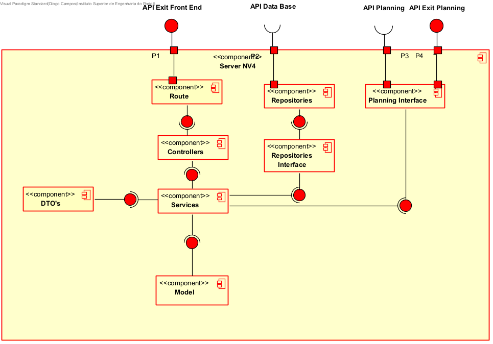

# Component Diagram C4

In the first image, we can visualize the component diagram until the third level, at that point, we can deeply analyse all the three levels.

## **NV1 & NV2**

On the level 1 we see the application has a black box 

On the level 2, we have three important components
- **BackEnd**
    - Which communicates via API with the FrontEnd, Planning and with some external entity
- **FrontEnd**
    - Communicates via API with BackEnd and some third party UI, (if needed)
- **Planning**
    - Only communicates via API with BackEnd, sending and receiving messsages

## **NV3**
When we analyse the level 3 inside the BackEnd, we can see some relevant components
- **Server**
    - Which does all the interactions via api mentioned before, and consumes the Data Base via API
- **Data Base**
    - Returns information via API to the Server

## **NV4**
Finally, when we reach the fouth level, inside the server, we see lots of components
- **Controller**
    - Responsible for communicate with the FrontEnd via API
    - Ask for information to Services
- **Services**
    - Asks for information to the repositories
    - Manage the information with the Model
    - Asks the planning interface for information about the planning
- **Model**
    - Handles the business logic
    - Interacts with Services, providing information about business logic
- **Repositories**
    - Persist information by sending it to the DataBase via API
- **Repositories Interface**
    - Interacts with Services in order to abstract the repositories, making possible have different DataBase types (e.g Relational, non-Relational databases), without need to touch our code
- **Planning Interface**
    - Responsible for interact with the Planning component, sending and receiving requests via API

