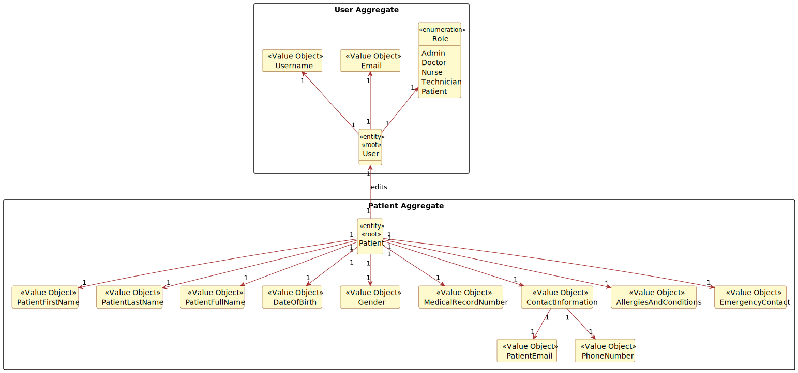
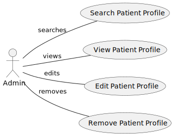
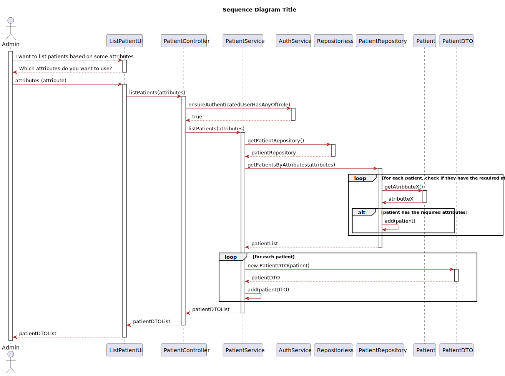

# US 5.1.11

## 1. Context

*This task was assigned in Sprint 1.  
Its purpose is for an Admin to be able to list patient profiles based on different attributes to view details, edit or remove patient profiles.*
## 2. Requirements

### 2.1. Acceptance Criteria
- Admins can search patient profiles by various attributes, including name, email, date of birth, or medical record number.
- The system displays search results in a list view with key patient information (name, email, date of birth).
- Admins can select a profile from the list to view, edit, or delete the patient record.
- The search results are paginated, and filters are available to refine the search results.

### 2.2. Description & Dependencies
**US 5.1.11** - As an Admin, I want to list/search patient profiles by different attributes, so that I can view the details, edit, and remove patient profiles.

We can find dependencies with the following functional requirements:
- **US 5.1.8** - A Patient's profile must be created by an Admin before being able to be edited or deleted.
  - **US 5.1.9** - An Admin must be able to edit an existing Patient's profile.
  - **US 5.1.10** - An Admin must be able to delete an existing Patient's profile.  

### 2.2 Client Specifications

> - **Question:**  
    "What types of filters can be applied when searching for profiles?"
      
> - **Answer:**  
    "Admins should be able to search patients by: name, email, phone number, medical record number, date of birth, gender.  
    If more than one search/filter parameter is used, the combination of filters should be considered as _AND_."

## 3. Analysis
An Admin lists patient profiles, filters are available to refine the search result.
The search results are paginated, the list of patient profiles is displayed in a list with key patient information (name, email, date of birth).
The Admin can select a profile from the list to view, edit, or delete the patient record.

### 3.1 Domain Model excerpt

### 3.2 Use case diagram

## 4. Design

#### 4.1 Sequence Diagram

 

## 5. Implementation

### PatientController

The Controller implements the methods:
- *getPatients* - calls the service to get all patients;
- *getPatientsFiltered* - calls the service to get filtered patients;
- *getPatientById* - calls the service to get a patient by id.

### PatientService
- *getAllPatientsAsync* - gets all patients from the repository, adds them to a dto list;
- *getPatientsFilteredAsync* - gets filtered patients from the repository, adds them to a dto list;
- *getPatientByIdAsync* - gets a patient by their id from the repository, adds it to a dto list.

### IPatientService
- *getAllPatientsAsync* - provides the method getAllPatientsAsync to the service;
- *getPatientsFilteredAsync* - provides the method getPatientsFilteredAsync to the service;
- *getPatientByIdAsync* - provides the method getPatientByIdAsync to the service.

**Major commits:**

* [Added code for . . .](https://github.com/...)

## 6. Integration/Demonstration

To be able to list, edit or delete patients, their profiles must be created.

The methods *GetAllAsync* and *GetByIdAsync* of the class *IRepository* were already implemented before the development of this functional requirement.

 

### User interaction demonstration

  
 None as of yet . . . 

## 7. Observations
None as of yet  