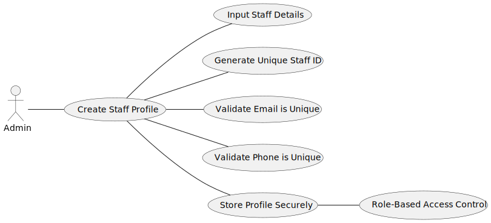

# US 5.1.12

## 1. Context

*This task was assigned in Sprint 1. <br>
Its purpose is for an Admin to be able to create new staff profiles.*
## 2. Requirements

### 2.1. Acceptance Criteria
- Admins can input staff details such as first name, last name, contact information, and specialization.
- A unique staff ID (License Number) is generated upon profile creation.
- The system ensures that the staff’s email and phone number are unique.
- The profile is stored securely, and access is based on role-based permissions.

### 2.2. Description & Dependencies
**US 5.1.12** - As an Admin, I want to create a new staff profile, so that I can add them to the hospital’s roster.

There were no dependencies found.


### 2.2 Client Specifications

> - **Question:** <br>
    "How should the specialization be assigned to a staff? Will there be a list of specializations in the system?"
    <br><br>
> - **Answer:** <br>
    "The system has a predefined list of specializations. Staff is assigned a specialization from that list, but the system should allow for future additions."

> - **Question:** <br>
    "Do nurses have specializations like doctors?"
    <br><br>
> - **Answer:** <br>
    "Yes, nurses can have specializations, which are important for specific surgeries."

> - **Question:** <br>
    "Are healthcare staff IDs unique across roles?"
    <br><br>
> - **Answer:** <br>
    "Yes, staff IDs are unique and not role-specific (e.g., a doctor and nurse can share the same ID format)."

> - **Question:**   
    "Regarding the creation of staff users and profiles, there are 2 separate use cases regarding backoffice users: One for the creation of the user account and another one for the creation of the staff's profile. 
  >   - Is there a fixed order for these operations to take place? Does the admin always create the profile first or can he create the user first aswell?   
  >   - If the profile is created first, for example, should the user be created automaticaly or should the admin create the user afterwards, having to do 2 distinct operations?"
    <br><br>
> - **Answer:** <br>
    "Recommended Flow:  
  >   - _Order of operations_: The system should support profile first. The admin should then create the user account. The account and user profile are linked by the professional email address or username (depending on the IAM provider). <br><br>
  >   - _Distinct Operations_: The operations should remain distinct, even if they are performed in quick succession. This ensures that each step (creating user credentials and creating a staff profile) is carefully tracked and managed.  <br><br>
  >   - _Validation_: The system should ensure that a staff profile and user account are both created and linked before the staff member can access the system. "


## 3. Analysis
An Admin creates a new profile for a Staff member, with the details: first name, last name, contact information, and specialization. The system checks for unique staff emails and phone numbers.  
The staff ID is automatically generated upon the creation of the profile.   
The profile is then stored securely in the system, and access is governed by role-based permissions.


### 3.1 Domain Model excerpt


### 3.2 Use case diagram


## 4. Design

#### 4.1 Sequence Diagram


<br>

## 5. Implementation

### ExampleController

The Controller implements the methods:
- *exampleMethod* - Explain what the method does;
- *exampleMethod2* - Explain what the method does;
```


```


**Major commits:**

* [Added code for . . .](https://github.com/...)


## 6. Integration/Demonstration

To be able to list exam grades, course must be created, an exam must be created and associated to said course, and a student take said exam.


The method *exampleMethod* of the class *exampleService* was already implemented before the development of this functional requirement.

<br>

### User interaction demonstration

<details>
  <summary> UI example when . . . </summary>


</details>


## 7. Observations
The reset of the password . . . <br>