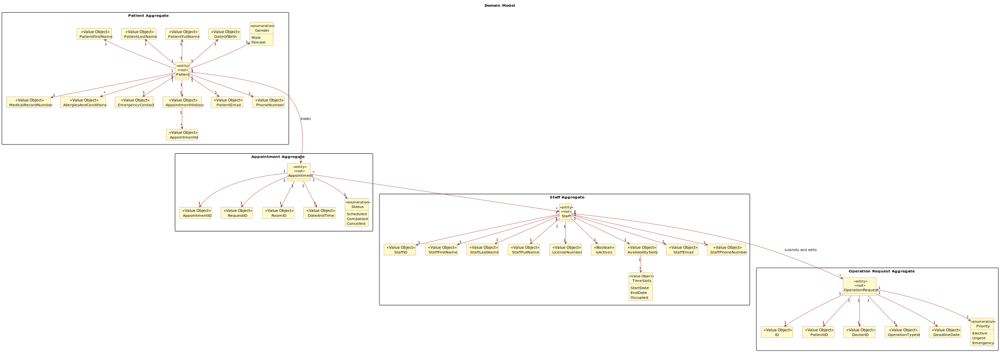
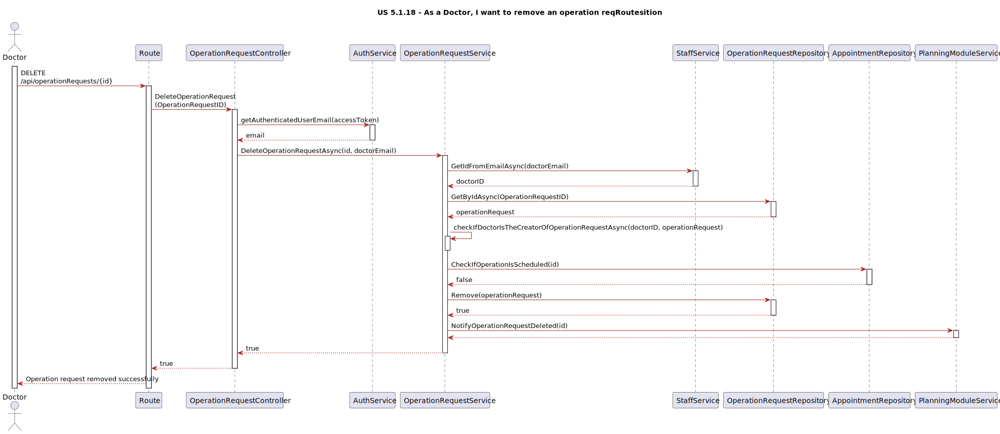

# US 5.1.18

## 1. Context

*This is a new feature that allows the doctor to remove an operation requisition.*

## 2. Requirements

**US 5.1.18** As a Doctor, I want to remove an operation requisition, so that the healthcare activities are provided as necessary.

**Acceptance Criteria:**

- 5118.1. Doctors can delete operation requests they created if the operation has not yet been scheduled.

- 5118.2. A confirmation prompt is displayed before deletion.

- 5118.3. Once deleted, the operation request is removed from the patient’s medical record and cannot be recovered.

- 5118.4. The system notifies the Planning Module and updates any schedules that were relying on this request.

**Dependencies/References:**

*Regarding this requirement we understand that it relates to the planning module, as it needs to be notified and updated. It also has a dependency to US 5.1.19 because the Doctor needs to select the operation request to delete.*


## 3. Analysis

**Questions and Answers with the client:**

```
Q: 
```
```
A:
```




## 4. Design



## 5. Implementation

*In this section the team should present, if necessary, some evidencies that the implementation is according to the design. It should also describe and explain other important artifacts necessary to fully understand the implementation like, for instance, configuration files.*

*It is also a best practice to include a listing (with a brief summary) of the major commits regarding this requirement.*

## 6. Integration/Demonstration

*In this section the team should describe the efforts realized in order to integrate this functionality with the other parts/components of the system*

*It is also important to explain any scripts or instructions required to execute an demonstrate this functionality*

## 7. Observations

*This section should be used to include any content that does not fit any of the previous sections.*

*The team should present here, for instance, a critical prespective on the developed work including the analysis of alternative solutioons or related works*

*The team should include in this section statements/references regarding third party works that were used in the development this work.*