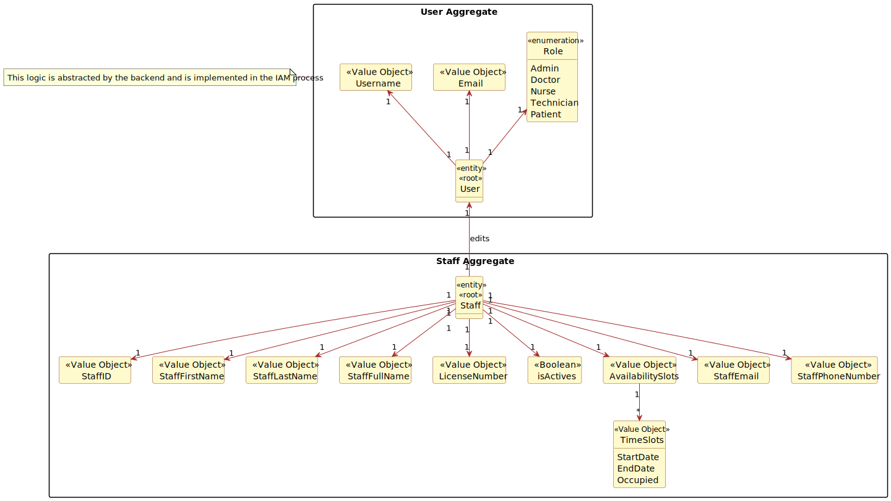
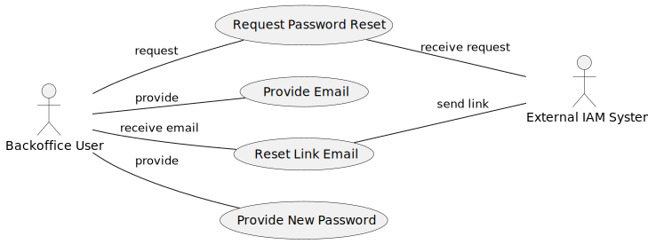

# US 5.1.2

## 1. Context

*This task was assigned in Sprint 1. <br>
Its purpose is for a backoffice user to be able to reset their password.*
## 2. Requirements

### 2.1. Acceptance Criteria
- Backoffice users can request a password reset by providing their email.
- The system sends a password reset link via email.
- The reset link expires after a predefined period (e.g., 24 hours) for security.
- Users must provide a new password that meets the system’s password complexity rules.

### 2.2. Description & Dependencies
**US 5.1.2** - As a Backoffice User (Admin, Doctor, Nurse, Technician), I want to reset my password if I forget it, so that I can regain access to the system securely.

We can find dependencies with the following functional requirements:
- **US 5.1.1** - Backoffice users need to be registered in the system in order to reset their password.
  - **US 5.1.12** - A staff member must be created in order to be registered in the system


### 2.2 Client Specifications

> - **Question:** <br>
    "What are the system's password requirements?"
    <br><br>
> - **Answer:** <br>
    "At least 10 characters long, at least a digit, a capital letter and a special character."


## 3. Analysis
A Backoffice User can request a password reset by providing the email associated with the account.  
The system acknowledges with the request, and sends a link via email to reset the password.  
The reset link expires after a predefined period, for added security.  
When resetting the password, the user must comply with the system's password complexity rules.

### 3.1 Domain Model excerpt


### 3.2 Use case diagram


## 4. Design
#### 4.1 Sequence Diagram


<br>
\
## 5. Implementation

### ExampleController

The Controller implements the methods:
- *exampleMethod* - Explain what the method does;
- *exampleMethod2* - Explain what the method does;
```


```


**Major commits:**

* [Added code for . . .](https://github.com/...)


## 6. Integration/Demonstration

To be able to list exam grades, course must be created, an exam must be created and associated to said course, and a student take said exam.


The method *exampleMethod* of the class *exampleService* was already implemented before the development of this functional requirement.

<br>

### User interaction demonstration

<details>
  <summary> UI example when . . . </summary>


</details>


## 7. Observations
The reset of the password . . . <br>