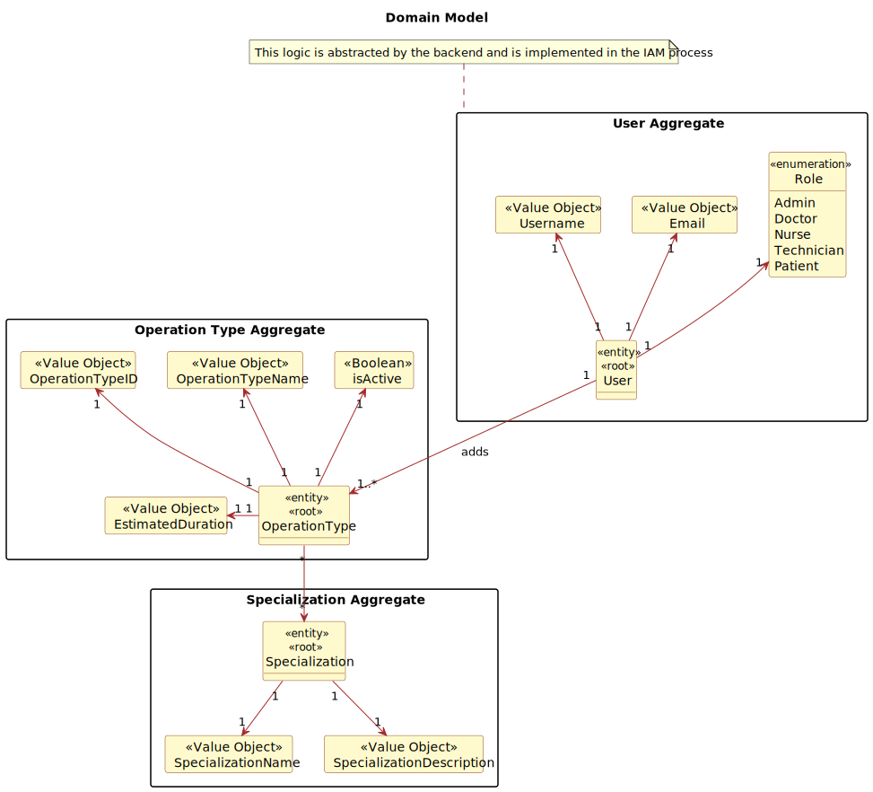
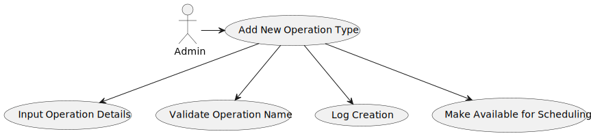
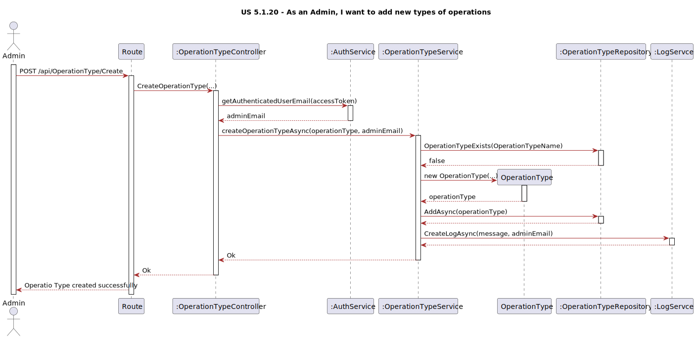

# US 5.1.20

## 1. Context

*This is a new feature that is being added to the system. The system should allow the admin to add new types of operations. This feature is important because it allows the system to reflect the available medical procedures in the system.*

## 2. Requirements

**US 5.1.20** As an Admin, I want to add new types of operations, so that I can reflect the available medical procedures in the system.

**Acceptance Criteria:**

- 5120.1. Admins can add new operation types with attributes like: 
			- Operation Name
			- Required Staff by Specialization
			- Estimated Duration

- 5120.2. The system validates that the operation name is unique.

- 5120.3. The system logs the creation of new operation types and makes them available for scheduling immediately.

**Dependencies/References:**

*Regarding this requirement we understand that it does not specifically relate to any other requirement.*

## 3. Analysis

**Questions and Answers with the client:**

```
Q: In the document with the surgeries, they all have 3 phases and respective duration:

-Anesthesia/patient preparation
-Surgery
-Cleaning

Can we assume while creating a new operation type, that the surgery must always have this 3 phases?
```

```
A: yes

```
```
Q: Na criação de um novo tipo de operação,

Temos um nome , 3 fases temporal da Cirurgia, lista "requeridas" de (especialidades, quantidade ).

Esse novo tipo de operação  não deve ter uma especialidade para alem das requeridas de modo segundo 5.1.16 AC2 um médico só pode marcar Cirurgia da sua especialidade?

O processo é criar o novo tipo de operação e depois adicionar a lista de especialidades requeridas?

```

```
A: sim. o tipo de operação está associado com uma dada especialidade. a lista de especialidaes faz parte integrante do tipo de operação. a criação é efetuada num único passo e não em dois passos como sugeres

```






## 4. Design



### 4.1. Realization

### 4.2. Class Diagram


### 4.3. Applied Patterns

### 4.4. Tests

Include here the main tests used to validate the functionality. Focus on how they relate to the acceptance criteria.

**Test 1:** *Verifies that it is not possible to ...*

**Refers to Acceptance Criteria:** G002.1


```
@Test(expected = IllegalArgumentException.class)
public void ensureXxxxYyyy() {
	...
}
````

## 5. Implementation

*In this section the team should present, if necessary, some evidencies that the implementation is according to the design. It should also describe and explain other important artifacts necessary to fully understand the implementation like, for instance, configuration files.*

*It is also a best practice to include a listing (with a brief summary) of the major commits regarding this requirement.*

## 6. Integration/Demonstration

*In this section the team should describe the efforts realized in order to integrate this functionality with the other parts/components of the system*

*It is also important to explain any scripts or instructions required to execute an demonstrate this functionality*

## 7. Observations

*This section should be used to include any content that does not fit any of the previous sections.*

*The team should present here, for instance, a critical prespective on the developed work including the analysis of alternative solutioons or related works*

*The team should include in this section statements/references regarding third party works that were used in the development this work.*