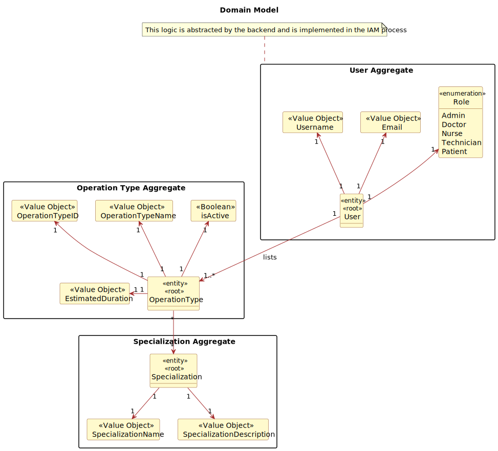
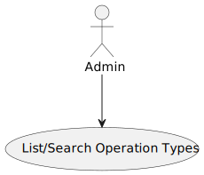
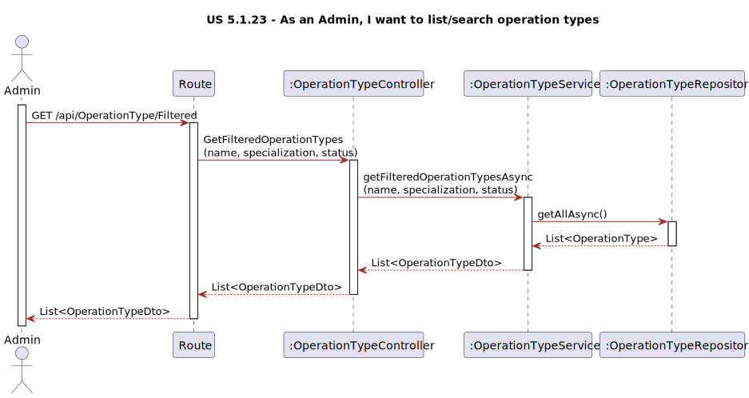

# US 5.1.23

## 1. Context

*This is a new feature that is being added to the system. The system should allow the admin to list/search operation types. This feature is important because it allows the admin to see the details, edit, and remove operation types.*

## 2. Requirements

**US 5.1.23** As an Admin, I want to list/search operation types, so that I can see the details, edit, and remove operation types.

**Acceptance Criteria:**

- 5123.1. Admins can search and filter operation types by name, specialization, or status (active/inactive).

- 5123.2. The system displays operation types in a searchable list with attributes such as name, required staff, and estimated duration.

- 5123.3. Admins can select an operation type to view, edit, or deactivate it.

**Dependencies/References:**

*Regarding this requirement we understand that it does not specifically relate to any other requirement.*

## 3. Analysis

## 4. Design

## 5. Implementation

*In this section the team should present, if necessary, some evidencies that the implementation is according to the design. It should also describe and explain other important artifacts necessary to fully understand the implementation like, for instance, configuration files.*

*It is also a best practice to include a listing (with a brief summary) of the major commits regarding this requirement.*

## 6. Integration/Demonstration

*In this section the team should describe the efforts realized in order to integrate this functionality with the other parts/components of the system*

*It is also important to explain any scripts or instructions required to execute an demonstrate this functionality*

## 7. Observations

*This section should be used to include any content that does not fit any of the previous sections.*

*The team should present here, for instance, a critical prespective on the developed work including the analysis of alternative solutioons or related works*

*The team should include in this section statements/references regarding third party works that were used in the development this work.*