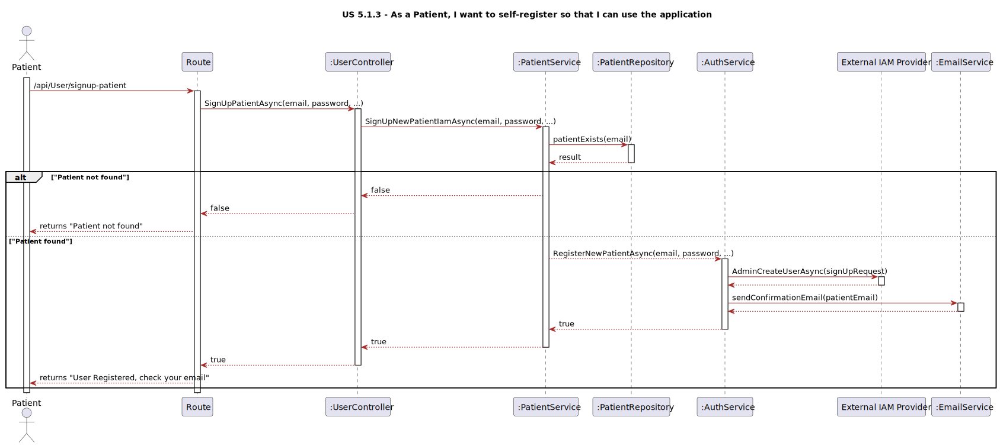

# US 5.1.3

## 1. Context

This is a new feature being developed for the first time in the system. Its purpose is to allow patients to register in the system as well as book appointments online. 

## 2. Requirements

**US 5.1.3** As a Patient, I want to register for the healthcare application, so that I can create a user profile and book appointments online.

**Acceptance Criteria:**

- 513.1. Patients can self-register using the external IAM system.

- 513.2. During registration, patients provide personal details (e.g., name, email, phone) and create a profile.

- 513.3. The system validates the email address by sending a verification email with a confirmation link.

- 513.4. Patients cannot list their appointments without completing the registration process.    


**Dependencies/References:**

*Regarding this requirement we understand that it has a dependency regarding US 5.1.8 because the patient needs to be already registered in the system is order to self-register as a user in the system.*

## 3. Analysis

**Questions and Answers with the client:**

```

Q: 5.1.3 Clarification about the verification of the email AC

```
```
A: 

Imagine the following scenario:

A patient is admitted to the hospital and a clerk registers their patient record with the email `abc@abc.com`. That's the patient's personal email.

Afterwards, that same patient wants to self-register in the system. The system uses an external IAM provider, XYZ. The patient will create an account in the IAM provider, e.g., `abc12@xy2z.com`, and will use that identity to self-register as patient `abc@abc.com`.

The system needs to send a verification email to `abc@abc.com`. When the patient follows the link sent to their personal email, the system will be able to "connect" the two emails as identifying the same person, and provide access to the system.

```


## 4. Design



### 4.1. Realization

### 4.2. Class Diagram


### 4.3. Applied Patterns

### 4.4. Tests

Include here the main tests used to validate the functionality. Focus on how they relate to the acceptance criteria.

**Test 1:** *Verifies that it is not possible to ...*

**Refers to Acceptance Criteria:** G002.1


```
@Test(expected = IllegalArgumentException.class)
public void ensureXxxxYyyy() {
	...
}
````

## 5. Implementation

*In this section the team should present, if necessary, some evidencies that the implementation is according to the design. It should also describe and explain other important artifacts necessary to fully understand the implementation like, for instance, configuration files.*

*It is also a best practice to include a listing (with a brief summary) of the major commits regarding this requirement.*

## 6. Integration/Demonstration

*In this section the team should describe the efforts realized in order to integrate this functionality with the other parts/components of the system*

*It is also important to explain any scripts or instructions required to execute an demonstrate this functionality*

## 7. Observations

*This section should be used to include any content that does not fit any of the previous sections.*

*The team should present here, for instance, a critical prespective on the developed work including the analysis of alternative solutioons or related works*

*The team should include in this section statements/references regarding third party works that were used in the development this work.*