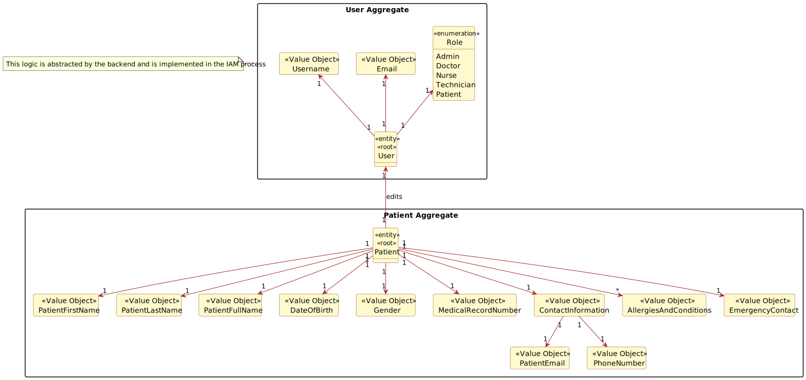
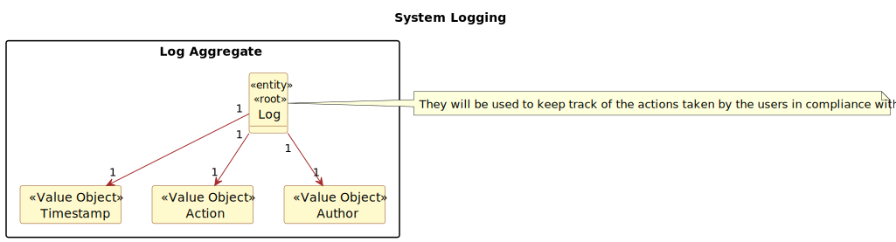

# US 5.1.5

## 1. Context

*This task was assigned in Sprint 1. <br>
Its purpose is for a patient to be able to delete their account and all associated data.*
## 2. Requirements

### 2.1. Acceptance Criteria
- Patients can request to delete their account through the profile settings.
- The system sends a confirmation email to the patient before proceeding with account deletion.
- Upon confirmation, all personal data is permanently deleted from the system within the legally required time frame (e.g., 30 days).
- Patients are notified once the deletion is complete, and the system logs the action for GDPR compliance.
- Some anonymized data may be retained for legal or research purposes, but all identifiable information is erased.

### 2.2. Description & Dependencies
**US 5.1.5** - As a Patient, I want to delete my account and all associated data, so that I can exercise my right to be forgotten as per GDPR.

We can find dependencies with the following functional requirements:
- **US 5.1.7** - A Patients needs to be able to log in using the IAM in order to register.
  - **US 5.1.3** - Patients need to be registered in the application in order to be able to delete their account.
    - **US 5.1.8** - A Patient's profile must be created by an admin before they can register. 
  


### 2.2 Client Specifications

> - **Question:** <br>
    "What happens to patient data after the profile is deleted?"
    <br><br>
> - **Answer:** <br>
    "Patient data must be retained for a legally mandated period before being anonymized or deleted."


## 3. Analysis
A Patient can go to their profile and delete their account.  
A confirmation email must be sent to the patient before deleting their account.  
If confirmed, all of the patient's personal data must be permanently deleted withing a legally defined time frame, but some anonymized data can be retained for legal or research purposes.  
Patients receive a notification once the deletion is complete, and the system logs the action for GDPR compliance.

### 3.1 Domain Model excerpts




### 3.2 Use case diagram


## 4. Design
#### 4.1 System Sequence Diagram


#### 4.2 Sequence Diagram


<br>

## 5. Implementation

### ExampleController

The Controller implements the methods:
- *exampleMethod* - Explain what the method does;
- *exampleMethod2* - Explain what the method does;
```


```


**Major commits:**

* [Added code for . . .](https://github.com/...)


## 6. Integration/Demonstration

To be able to list exam grades, course must be created, an exam must be created and associated to said course, and a student take said exam.


The method *exampleMethod* of the class *exampleService* was already implemented before the development of this functional requirement.

<br>

### User interaction demonstration

<details>
  <summary> UI example when . . . </summary>


</details>


## 7. Observations
The reset of the password . . . <br>