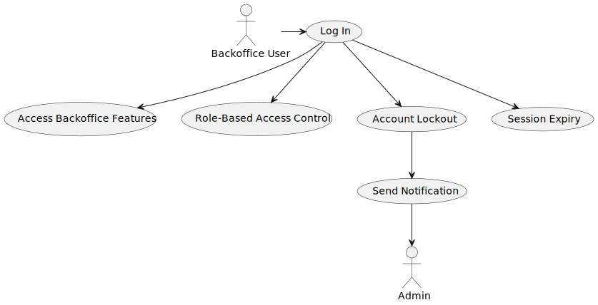

# US 5.1.6

## 1. Context

*This is a new feature that is being implemented in the system. The user needs to be able to log in to the system using his credentials, so that he can access the backoffice features according to his assigned role.*

## 2. Requirements

**US 5.1.6** As a (non-authenticated) Backoffice User, I want to log in to the system using my credentials, so that I can access the backoffice features according to my assigned role.

**Acceptance Criteria:**

- 516.1. Backoffice users log in using their username and password.

- 516.2. Role-based access control ensures that users only have access to features appropriate to their role (e.g., doctors can manage appointments, admins can manage users and settings).

- 516.3. After five failed login attempts, the user account is temporarily locked, and a notification is sent to the admin.

- 516.4. Login sessions expire after a period of inactivity to ensure security.

**Dependencies/References:**

*Regarding this requirement we understand that it relates to US 5.1.1 because the user needs to already be registered in the system in order to log in.*

## 3. Analysis

*In this section, the team should report the study/analysis/comparison that was done in order to take the best design decisions for the requirement. This section should also include supporting diagrams/artifacts (such as domain model; use case diagrams, etc.),*

## 4. Design

## 5. Implementation

*In this section the team should present, if necessary, some evidencies that the implementation is according to the design. It should also describe and explain other important artifacts necessary to fully understand the implementation like, for instance, configuration files.*

*It is also a best practice to include a listing (with a brief summary) of the major commits regarding this requirement.*

## 6. Integration/Demonstration

*In this section the team should describe the efforts realized in order to integrate this functionality with the other parts/components of the system*

*It is also important to explain any scripts or instructions required to execute an demonstrate this functionality*

## 7. Observations

*This section should be used to include any content that does not fit any of the previous sections.*

*The team should present here, for instance, a critical prespective on the developed work including the analysis of alternative solutioons or related works*

*The team should include in this section statements/references regarding third party works that were used in the development this work.*