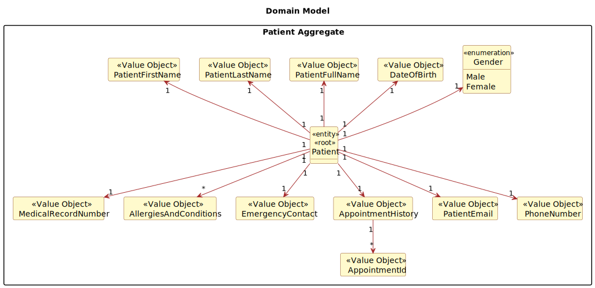

# US 5.1.8


## 1. Context

*This a new feature that is being implemented in the system. The admin needs to be able to create a new patient profile, so that he can register their personal details and medical history.*

## 2. Requirements

**US 5.1.8** As an Admin, I want to create a new patient profile, so that I can register their personal details and medical history.

**Acceptance Criteria:**

- 518.1. Admins can input patient details such as first name, last name, date of birth, contact information, gender, emergency contact.

- 518.2. A unique patient ID (Medical Record Number) is generated upon profile creation.
 
- 518.3. The system validates that the patient’s email and phone number are unique.

- 518.4. The profile is stored securely in the system, and access is governed by role-based permissions.

**Dependencies/References:**

*Regarding this requirement we understand that it doesn't specifically relate to any other user story*

## 3. Analysis

**Questions and Answers with the client:**

```
Q: So, when the administrator starts creating the patient profile, what format(s) of the date of birth will they need to enter? Furthermore, what will be the format of the Medical Record Number generated after recording the data?
```
```
A: From a usability perspective, dates should be presented to the user using the operating system's locale definitions. since for this sprint you are building an API, you should use a standard format like ISO 8601. Medical record numbers are generated by the system following the format YYYYMMnnnnnn where YYYY and MM are the year and month of the registration and nnnnnn is a sequential number
```
```
Q: It is specified that the admin can input some of the patient's information (name, date of birth, contact information, and medical history). Do they also input the omitted information (gender, emergency contact and allergies/medical condition)? Additionally, does the medical history that the admin inputs refer to the patient's medical record, or is it referring to the appointment history?
```
```
A: the admin can not input medical history nor allergies. they can however input gender and emergency contact
```
```
Q: When an Admin creates a patient profile, should he already register them in the system, as users that can login, or should the registration always be responsibility of the patient? If the latter is intended, should the patient's user credentials be linked to the existing profile?
```
```
A: the admin register the patient (this does not create a user for that patient) optionally, the patient self-registers in the system by providing the same email that is currently recorded in their patient record and the system associates the user and the patient there is no option for someone who is not a patient of the system to register as a user
```




## 4. Design


### 4.1. Realization

### 4.2. Class Diagram


### 4.3. Applied Patterns

### 4.4. Tests

Include here the main tests used to validate the functionality. Focus on how they relate to the acceptance criteria.

**Test 1:** *Verifies that it is not possible to ...*

**Refers to Acceptance Criteria:** G002.1


```
@Test(expected = IllegalArgumentException.class)
public void ensureXxxxYyyy() {
	...
}
````

## 5. Implementation

*In this section the team should present, if necessary, some evidencies that the implementation is according to the design. It should also describe and explain other important artifacts necessary to fully understand the implementation like, for instance, configuration files.*

*It is also a best practice to include a listing (with a brief summary) of the major commits regarding this requirement.*

## 6. Integration/Demonstration

*In this section the team should describe the efforts realized in order to integrate this functionality with the other parts/components of the system*

*It is also important to explain any scripts or instructions required to execute an demonstrate this functionality*

## 7. Observations

*This section should be used to include any content that does not fit any of the previous sections.*

*The team should present here, for instance, a critical prespective on the developed work including the analysis of alternative solutioons or related works*

*The team should include in this section statements/references regarding third party works that were used in the development this work.*